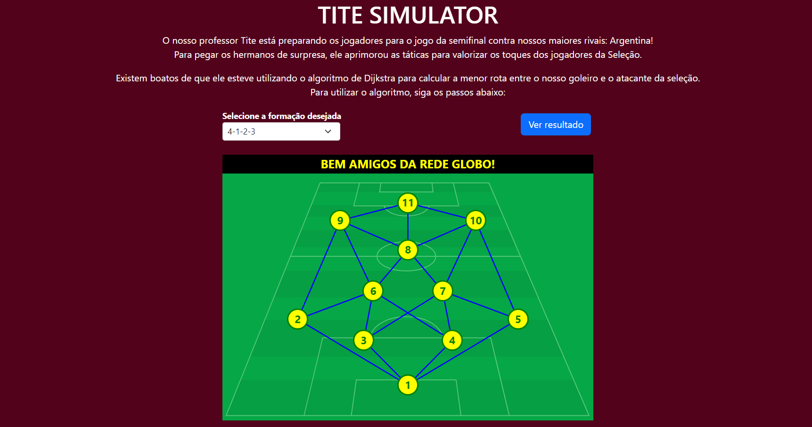
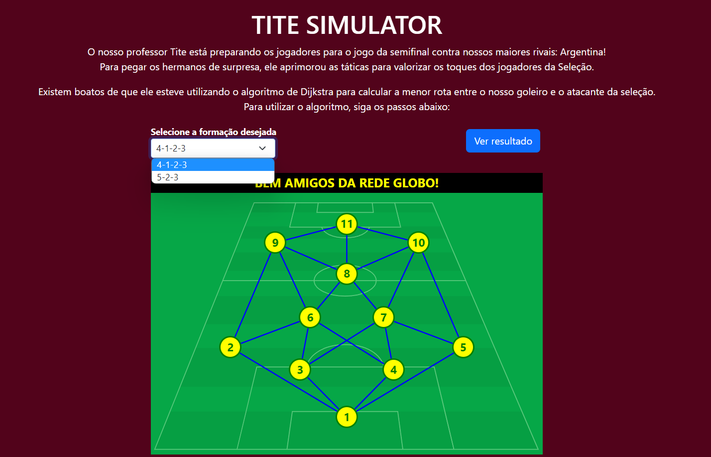
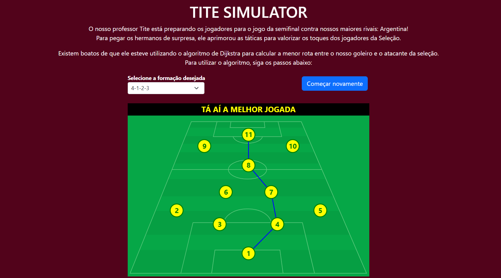

# Grafos1_TiteSimulator

**Número da Lista**: 16 
**Conteúdo da Disciplina**: Grafos 2 

## Alunos
| Matrícula | Aluno                                                       |
| --------- | ----------------------------------------------------------- |
| 180063162 | [Daniel Primo](https://github.com/danieldagerom)        |
| 150011903 | [Igor Aragão](https://github.com/roginaldosemog)            |

## Sobre 
O objetivo do projeto é utilizar o algoritmo de Dijkstra para mostrar o melhor caminho de passes para a bola chegar do goleiro ao atacante.

## Screenshots

  

  

  

## Instalação 
**Linguagem**: Javascript 
**Framework**: React 

Para rodar o projeto instale as dependências descritas no [tutorial oficial do React](https://reactjs.org/tutorial/tutorial.html).

Após a instalação, rode os comandos `yarn install` e em seguida `yarn start`.

## Uso 
Selecione a formação desejada e clique em "Ver Resultado".
Também está disponível em https://titesimulator2.netlify.app/

